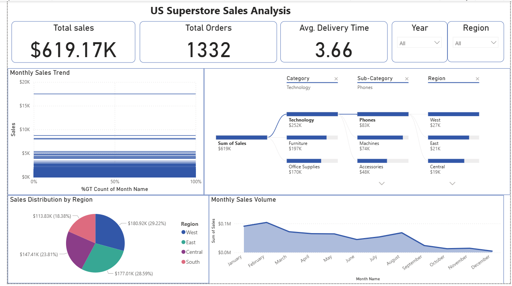

# US Superstore Sales Analysis (Power BI)

### 📊 Dashboard Overview
 

### 🎯 Project Overview
This project analyzes the sales performance and logistics efficiency of a US Superstore using a dataset from **Kaggle**.

### 💡 Key Insights & Results
- **Logistics Correction:** Cleaned date format inconsistencies using **DAX**, resulting in an accurate average delivery time of **3.68 days**.
- **Regional Performance:** The **West region** is the top performer, contributing over 40% of total sales.
- **Category Analysis:** Technology remains the dominant category, driven largely by Phones and Accessories.

### 🛠️ Tools Used
- **Power BI Desktop**
- **Power Query** (Data Cleaning & Transformation)
- **DAX** (Measures for Sales & Delivery calculations)
